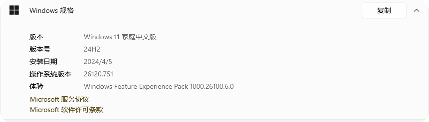
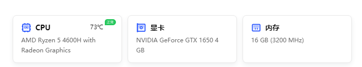

# 0. 目录介绍

~~~
D:.
│  dataset.ipynb
│  dataset.py
│  data_analysis.ipynb
│  data_preprocessing.ipynb
│  fine1.py
│  fine2.py
│  main.py
│  README.md
│  test.py
│  test_gradient.py
│  TransformerModel.py
│  transformer_preprossing.ipynb
│
├─data
│  │  Shanghai_T1DM_Summary.csv
│  │  Shanghai_T2DM_Summary.csv
│  │
│  ├─Shanghai_T1DM
│  └─Shanghai_T2DM
├─dataset
│  ├─T1DM
│  ├─T1DM_Augmentation
│  ├─T1DM_Upsampling
│  ├─T2DM
│  ├─T2DM_Augmentation
│  └─T2DM_Downsampling
├─models
└─runs
~~~

`dataset.py` 是加载数据集的代码

`fine1.py` 是针对T1DM微调的代码

`fine2.py` 是针对T2DM微调的代码

`TransformerModel.py` 是Transformer的实现

`test_gradient.py` 是梯度综合分析展示特征贡献度的代码

`test.py` 是用于测试模型的 MSE 和 MAE 的代码

`transformer_preprossing.ipynb` 和 `dataset.ipynb` 是在训练之前再对数据集进行加工的代码

`data_preprocessing.ipynb` 和 `data_analysis.ipynb` 是数据预处理和相关性分析特征工程的代码

`data` 是原数据文件夹

`dataset` 是处理后数据文件夹

`models` 是存放模型文件夹

`runs` 是存放运行日志文件夹

# 1. 运行环境

* GPU cuda版本：

* 系统版本：

* 硬件规格

* python版本为 3.11.5 ，深度学习框架主要使用  pytorch == 2.2.2+cu121
* 其他 python 库主要使用了numpy, matplotlib, tqdm, tensorboard, sklearn, pandas 

# 2.运行步骤

1. 预训练模型训练请将处理好的数据放置到指定文件夹下后运行 main.py 文件
2. 微调模型可以分别运行 fine1.py 和 fine2.py 文件，需要填入预训练的模型路径
3. 测试模型可以运行 test.py 文件，需要填入模型路径
4. 梯度综合分析展示特征贡献度可以直接运行 test_gradient.py